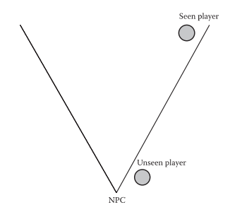

# AI

Personal AI tools from AAA games research. 

## Features

- `FieldView` Provide a fov query system for AI.

- `FieldViewPrime` Provide an advanced fov query system for AI based on the article "Naughty Dog: Human Enemy AI In Last of The Us" in 《GameAIPro3》.

- `PostQuery` Provide a dynamical post query system for shooter game AI to increase randomization.

## Integration

Provide Integration for my other plugins.

- `AkiBT` Behavior tree solution.
- `AkiGOAP` Goal oriented action planning solution.

## Reference Blog

[Create a shooter game AI in Unity: Getting Started](https://www.akikurisu.com/blog/posts/make-shooter-game-ai-in-unity-1-2024-07-27/)

TODO