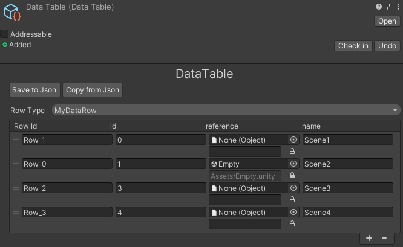

# Data Driven

Use Unreal-like DataTable workflow in Unity.

## Example

```C#
using System;
using Kurisu.Framework.DataDriven;
using Kurisu.Framework.Resource;
using Kurisu.Framework.Serialization;
using UnityEngine;

[Serializable]
public class MyDataRow : IDataTableRow
{
    public int id;
    public SoftAssetReference reference;
    public string name;
}
```




