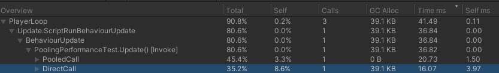

# Pool

Zero allocation GameObject/Component pooling. 

## Performance

```C#
public class PoolingPerformanceTest : MonoBehaviour
{
    private class PooledAudioSource : PooledComponent<PooledAudioSource, AudioSource> { }
    public GameObject prefab;
    private const int maxCount = 1000;
    private readonly PooledGameObject[] list1 = new PooledGameObject[maxCount];
    private readonly GameObject[] list2 = new GameObject[maxCount];
    private void Update()
    {
        PooledCall();
        DirectCall();
    }
    private void PooledCall()
    {
        Profiler.BeginSample(nameof(PooledCall));
        for (int i = 0; i < maxCount; ++i)
        {
            list1[i] = PooledAudioSource.Instantiate(prefab, transform);
        }
        for (int i = 0; i < maxCount; ++i)
        {
            list1[i].Dispose();
        }
        Profiler.EndSample();
    }
    private void DirectCall()
    {
        Profiler.BeginSample(nameof(DirectCall));
        for (int i = 0; i < maxCount; ++i)
        {
            list2[i] = Instantiate(prefab, transform);
        }
        for (int i = 0; i < maxCount; ++i)
        {
            Destroy(list2[i]);
        }
        Profiler.EndSample();
    }
}
```



The time taken will be longer than the original one. For prefabs with multiple components (such as bullets), the time taken may be shorter than the original one, depending on the heavy weight of `Awake()` and `Start()`.