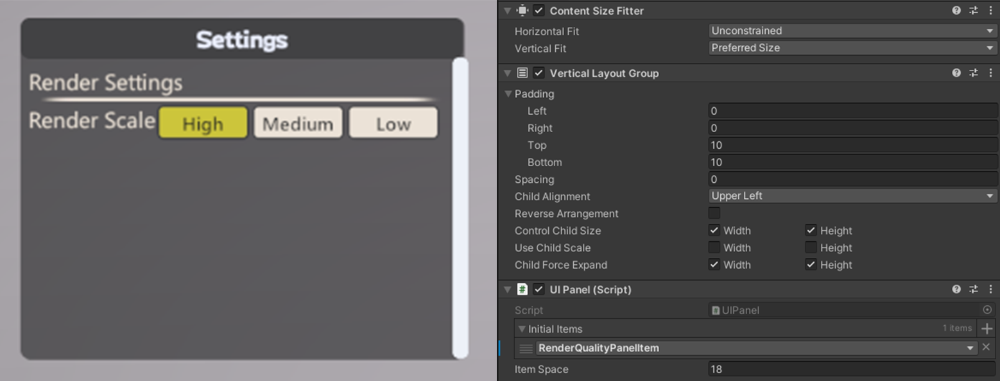

# UI

Build UGUI in script easily, useful for creating dynamic setting UI and debug menu.

### Setup

Each ui element implements `BaseField` or `BaseField<T>` should have a prefab registered to Addressables Asset Group and use type's name as address.

Attach `UIPanel.cs` to the actual visual widget.

Implement `IPanelItem` and assign it to the `initialItems` of UIPanel, or add fields to the panel directly by script.

### Example

```C#
public static class RenderingSettings
{
    public static ReactiveProperty<int> RenderScaleIndex = new(0);
}

public class RenderQualitygSettingsPanelItem : IPanelItem
{
    public void CreatePanelItem(UIPanel panel, ref PanelItem panelItem)
    {
        // subscription will be disposed when monobehaviour destroyed
        var unregister = panel.GetUnRegister();
        new LabelField("Render Settings").AddToPanelItem(ref panelItem);
        new SeparatorField().AddToPanelItem(ref panelItem);
        new RadioButtonsField("Render Scale", new string[3] { "High", "Medium", "Low" })
            .BindProperty(RenderingSettings.RenderScaleIndex, ref unregister)
            .AddToPanelItem(ref panelItem);
    }
}
```



### How to customize

```C#
// Example to inherit from ToggleField
public class MyToggleField : ToggleField
{
    public new class UIFactory : UIFactory<VolumeToggleField>
    {
        // Override default ui style
        public UIFactory() : base(new UIStyle()
        {
            TextColor = new Color(0.9294118f, 0.945098f, 1)
        })
        { }
    }
    private static readonly IUIFactory defaultFactory = new UIFactory();

    // Override default ui factory of ToggleField
    public MyToggleField(string displayName, bool initialValue) : base(defaultFactory, displayName, initialValue)
    {
    }
}
```