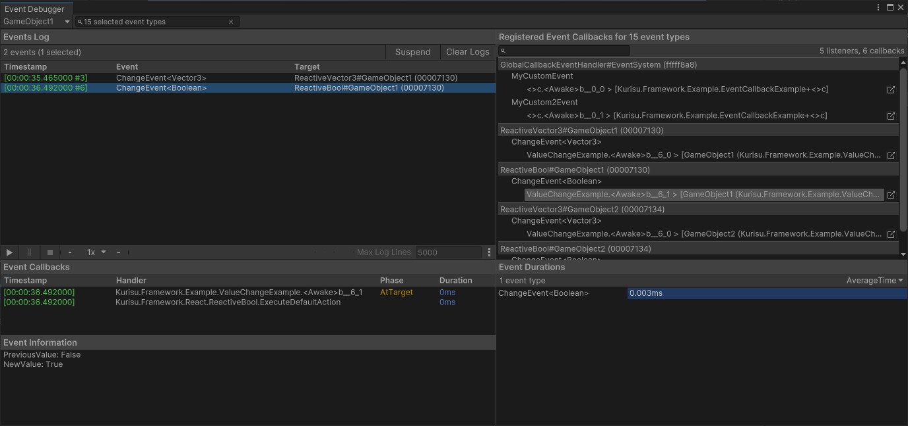

# AkiFramework

A Unity game framework designed for efficient development.

## Core Features

[Events](./Docs/Events.md) 
> A powerful event solution for dynamic and contextual event handling ported from UIElement.

[Pool](./Docs/Pool.md) 
> Zero allocation GameObject/Component pooling. 

[Schedulers](./Docs/Schedulers.md) 
> Zero allocation timer/frame counter. 

[Serialization](./Docs/Serialization.md)
> Powerful serialization tool for workflow.

[Resource](./Docs/Resource.md) 
> Resource loading system, effect system based on Addressables. 

[Data Driven](./Docs/DataDriven.md)
>Use Unreal-like DataTable workflow in Unity.

[Animations](./Docs/Animations.md)
>Create dynamic animation sequence and cutscene from script based on Playables.

## Modules

Modules are based on core features.

[AI](./Docs/AI.md)

>Personal AI tools from AAA games research. 

[Mod](./Docs/Mod.md) 
> Mod workflow based on Addressables. 

[UI](./Docs/UI.md) 
> Build UGUI in script easily, useful for creating dynamic setting UI and debug menu.

[Ceres](./Docs/Ceres.md)
> Node based visual scripting framework using Graphview.

## Reference

[R3](https://github.com/Cysharp/R3)

[UniTask](https://github.com/Cysharp/UniTask)

[Unity.UIElements](https://github.com/Unity-Technologies/UnityCsReference/tree/2022.3/ModuleOverrides/com.unity.ui/Core)

[Unity Timer](https://github.com/akbiggs/UnityTimer)

## License

MIT